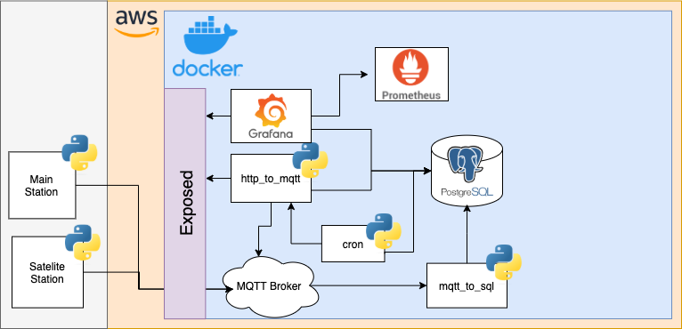

# NODEMCU THERMOSTAT

This is an IOT project about a thermostat connected to wifi. Is based on the ESP8266 microcontroller and it has (optionally) two stations.

## Architecture diagram

The diagram above shows all the components of the system and the connections between them.

The main station is connected to the heater and controls it. It has buttons to select the desired temperature and mode and an lcd screen to display relevant information.

The satelite station is a thermometer which sends the temperature to the main station. With that, you can control the heater based on the temperature from other room.

The main and the satellite stations communicate each other via the MQTT broker. Meanwhile, a python process is listening the MQTT topics in order to collect the information and stores it into the database.

The main station is prepared to change some parameters based on what it receives from the MQTT Broker. An HTTP API is provided by the `http_to_mqtt` application in order to remotely modify the setted temperature and mode of the main station.

The Grafana panels show relevant information to monitor.

The prometheus service collect metrics from the system and the docker containers to monitorize the system's health.

## Continue reading

- [Main station](./main-station.md)
- [Satelite station](./satelite-station.md)