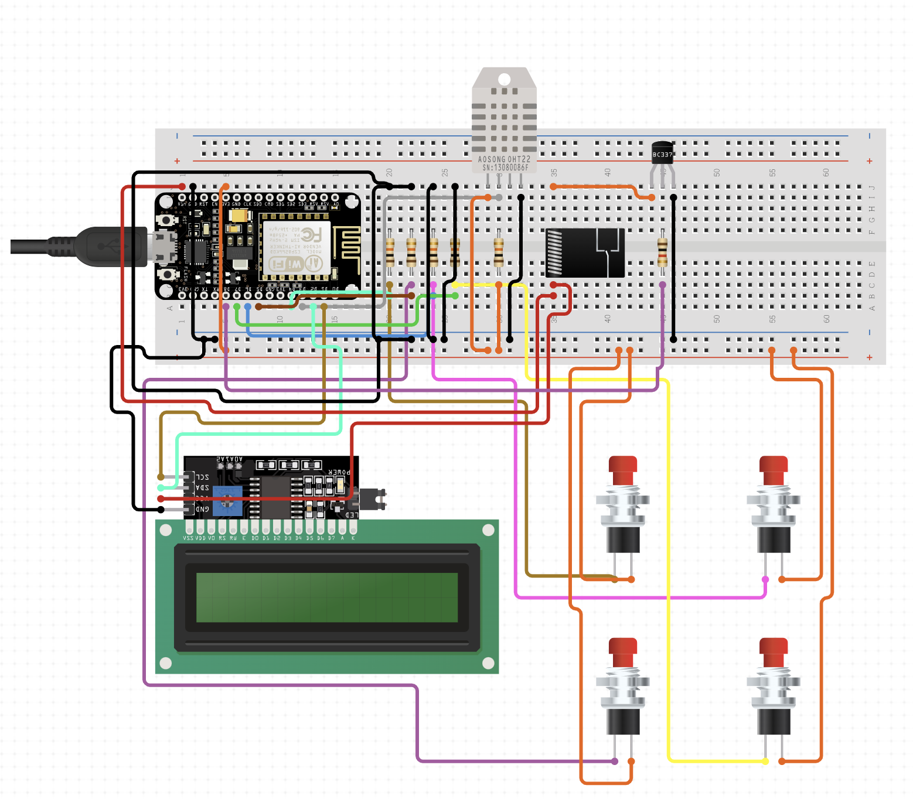

# Main station

The main station has a thermometer and a relay connected to the heater. It opens or close the relay based on the temperature measured by the thermometer and the temperature setted by the user. The relevant information is shown in a 16x2 LCD display. In order to set the temperature and control other options, the main station has four buttons. From left to right:

    1. Switch between local and remote mode (explains below).
    2. Turn on the screen (it turns off based on a timeout).
    3. Decrease the setted temperature
    4. Increase the setted temperature

