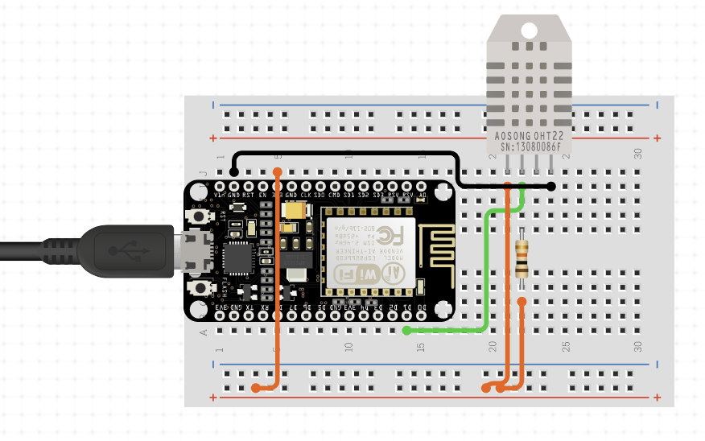

### Satelite station

This station only has a thermometer and the microcrontroller. It sends the measures to the MQTT broker and if the main station is in "remote mode" that will be the temperature setted to control the heater.

